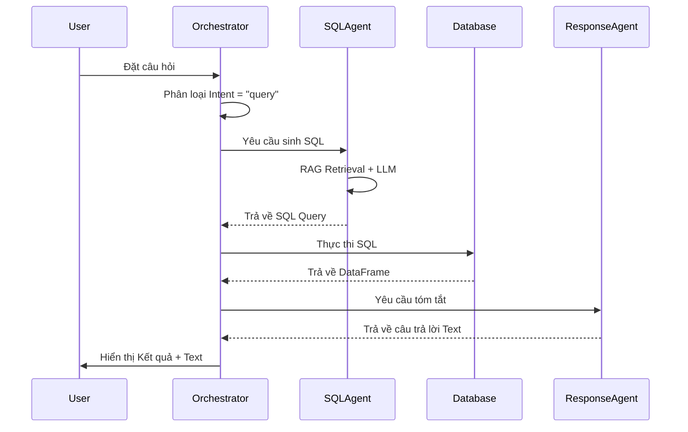
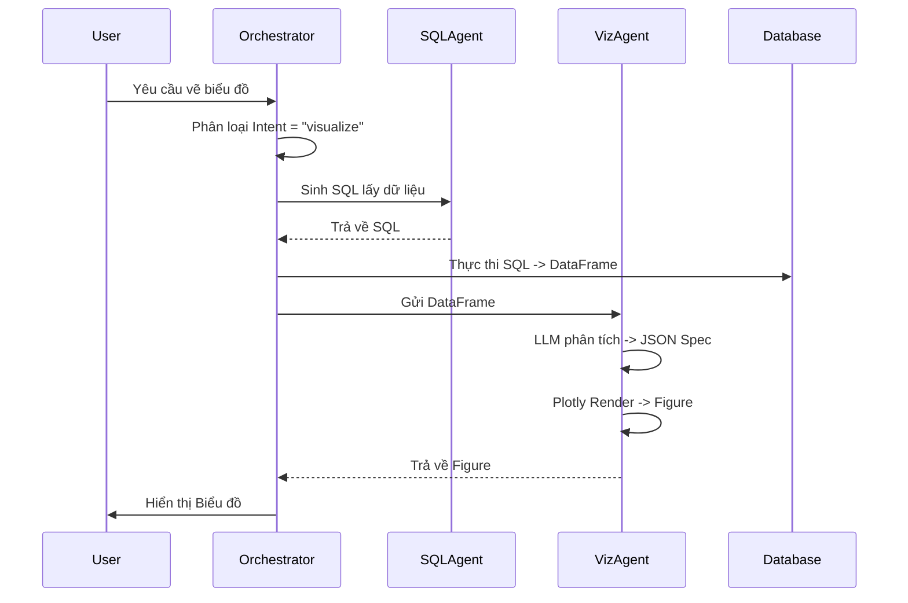
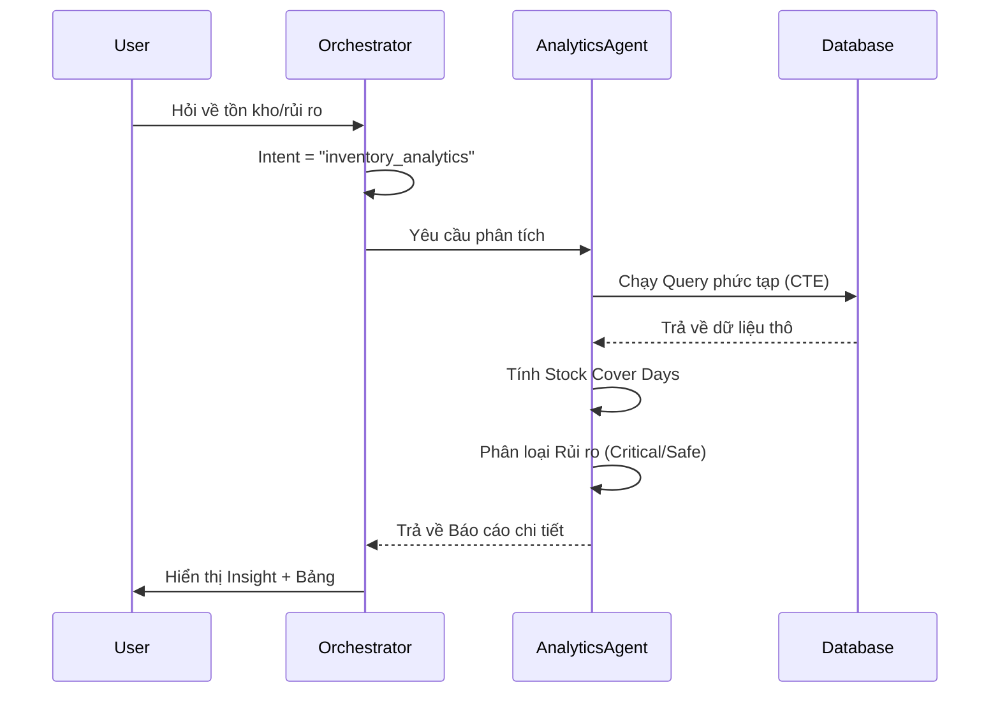
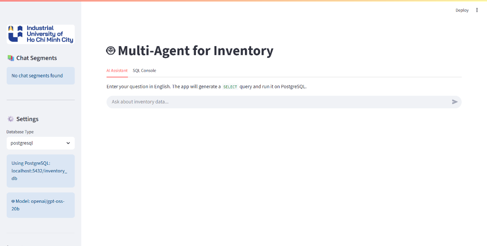

# CHƯƠNG 3. PHÂN TÍCH VÀ THIẾT KẾ HỆ THỐNG

## 3.1. Yêu cầu hệ thống

### 3.1.1. Yêu cầu chức năng
Hệ thống cần đáp ứng các nhóm chức năng chính sau:
1.  **Tương tác ngôn ngữ tự nhiên:** Người dùng có thể đặt câu hỏi bằng tiếng Anh về tình hình kho hàng.
2.  **Truy xuất dữ liệu (Text-to-SQL):** Hệ thống tự động chuyển đổi câu hỏi thành truy vấn SQL để lấy dữ liệu chính xác từ database (tồn kho, sản phẩm, nhập xuất).
3.  **Phân tích nâng cao (Analytics):** Tính toán được các chỉ số không có sẵn trực tiếp trong bảng như: Tỷ lệ vòng quay hàng tồn kho (Turnover Rate), Số ngày bán hết hàng (Stock Cover).
4.  **Trực quan hóa (Visualization):** Tự động vẽ biểu đồ (cột, tròn, đường) phù hợp với dữ liệu trả về khi người dùng yêu cầu.
5.  **Tra cứu quy trình (RAG):** Trả lời các câu hỏi về quy trình, chính sách kho dựa trên tài liệu nội bộ.

### 3.1.2. Yêu cầu phi chức năng
-   **Độ trễ (Latency):** Thời gian phản hồi trung bình dưới 5 giây cho các câu hỏi truy vấn dữ liệu.
-   **Độ chính xác:** Câu lệnh SQL sinh ra phải chính xác về mặt cú pháp và logic nghiệp vụ.
-   **Giao diện:** Thân thiện, dễ sử dụng (Chat Interface), hiển thị tốt trên trình duyệt web.

## 3.2. Kiến trúc tổng thể
Hệ thống được xây dựng theo kiến trúc Microservices giả lập, bao gồm các thành phần chính:

1.  **Frontend (Streamlit):** Giao diện Chatbot, nơi người dùng nhập câu hỏi và nhận kết quả (text, bảng, biểu đồ).
2.  **Orchestrator (Custom Python/LangChain):** "Bộ não" điều phối, chịu trách nhiệm nhận câu hỏi, gọi các Agent phù hợp và tổng hợp kết quả.
3.  **Agent Layer:** Tập hợp các Agent chuyên biệt (Intent Classifier, SQL Generator, Analyst, Visualizer).
4.  **Data Layer:**
    -   *Structured Data (PostgreSQL):* Chứa dữ liệu nghiệp vụ (Products, Inventory, Transactions).
    -   *Unstructured Data (Vector DB):* Chứa tài liệu quy trình đã được vector hóa.
5.  **LLM Service:** Sử dụng mô hình ngôn ngữ (ví dụ: GPT-4o hoặc Gemini) để xử lý ngôn ngữ và suy luận.

*Hình 3.2. Kiến trúc tổng thể hệ thống*

## 3.3. Thiết kế chi tiết các Agent

### 3.3.1. Intent Classification Agent (Phân loại ý định)
-   **Nhiệm vụ:** Phân tích câu hỏi người dùng và phân loại vào 4 nhóm ý định chính.
-   **Công nghệ:** Sử dụng LLM (qua Groq API) với prompt kỹ thuật Few-shot.
-   **Input:** Câu hỏi người dùng (Tiếng Anh).
-   **Output:** JSON chứa `intent` và `confidence`. Các loại intent:
    -   `query`: Truy vấn dữ liệu thông thường (VD: "How many products...").
    -   `visualize`: Yêu cầu vẽ biểu đồ (VD: "Show me a chart of...").
    -   `inventory_analytics`: Phân tích chuyên sâu về tồn kho (VD: "Stock cover days", "Critical items").
    -   `schema`: Hỏi về cấu trúc dữ liệu (VD: "List all tables").

### 3.3.2. SQL Generation Agent
-   **Nhiệm vụ:** Sinh câu lệnh SQL tối ưu cho PostgreSQL.
-   **Kỹ thuật:**
    -   **RAG-based Few-shot:** Tìm kiếm các cặp Câu hỏi-SQL mẫu tương tự từ `examples.jsonl` sử dụng Vector Search (ChromaDB).
    -   **Schema-aware Prompting:** Đưa thông tin metadata của database (từ `metadata_db.yml`) vào prompt để LLM hiểu cấu trúc bảng.
-   **Input:** Câu hỏi + Top-k ví dụ tương tự + Schema Context.
-   **Output:** Câu lệnh SQL (đã được validate cú pháp).

### 3.3.3. Analytics Agent
-   **Nhiệm vụ:** Tính toán các chỉ số quản trị kho hàng mà SQL đơn thuần khó thực hiện.
-   **Chức năng chính:**
    -   **Stock Cover Days:** Tính số ngày tồn kho dựa trên tốc độ bán hàng (Sales Velocity).
    -   **Stock Status Classification:** Phân loại trạng thái hàng (Critical, Warning, Healthy, Overstock).
-   **Input:** Dữ liệu tồn kho và lịch sử bán hàng.
-   **Output:** DataFrame kết quả phân tích kèm báo cáo tóm tắt (Natural Language Summary).

### 3.3.4. Visualization Agent
-   **Nhiệm vụ:** Tạo biểu đồ trực quan từ dữ liệu.
-   **Quy trình:**
    1.  Nhận dữ liệu (DataFrame) từ SQL Agent.
    2.  Sử dụng LLM để phân tích dữ liệu và sinh **đặc tả biểu đồ (JSON Spec)** (loại biểu đồ, trục x, trục y...).
    3.  Dựa trên đặc tả, sử dụng thư viện **Plotly** (hoặc Matplotlib) để vẽ và trả về đối tượng Figure hiển thị trên Streamlit.

### 3.3.5. Response Agent (Tổng hợp câu trả lời)
-   **Nhiệm vụ:** Sinh câu trả lời ngôn ngữ tự nhiên ngắn gọn từ kết quả truy vấn.
-   **Quy trình:**
    1.  Nhận đầu vào gồm: Câu hỏi người dùng, Câu lệnh SQL (để lấy ngữ cảnh), và DataFrame kết quả.
    2.  Sử dụng LLM với Prompt chuyên biệt để tóm tắt kết quả thành một câu văn ngắn gọn, súc tích (ví dụ: "Tổng tồn kho hiện tại là 1,500 sản phẩm").
    3.  Trả về câu trả lời dạng text kèm theo bảng dữ liệu (nếu có) để hiển thị lên giao diện.

## 3.4. Mô tả dữ liệu và Lược đồ CSDL
Dữ liệu của hệ thống được thu thập và xử lý từ bộ dataset trên Kaggle, sau đó được mô hình hóa và lưu trữ vào PostgreSQL với lược đồ gồm 4 bảng chính:

1.  **warehouses (Kho hàng):**
    -   `warehouse_code` (PK): Mã kho.
    -   `city`, `province`, `country`: Địa điểm.
    -   `latitude`, `longitude`: Tọa độ địa lý.

2.  **skus (Sản phẩm):**
    -   `sku_id` (PK): Mã sản phẩm.
    -   `sku_name`: Tên sản phẩm.

3.  **inventory (Tồn kho):**
    -   `id` (PK), `sku_id` (FK), `warehouse_id` (FK).
    -   `vendor_name`: Tên nhà cung cấp.
    -   `current_inventory_quantity`: Số lượng tồn hiện tại.
    -   `units`: Đơn vị tính (VD: Kg, Cái).
    -   `unit_price`: Đơn giá bán.
    -   `cost_per_sku`: Giá vốn.
    -   `total_value`: Tổng giá trị tồn kho.
    -   `average_lead_time_days`: Thời gian nhập hàng trung bình.
    -   `maximum_lead_time_days`: Thời gian nhập hàng tối đa.

4.  **sales (Bán hàng):**
    -   `id` (PK), `order_number`.
    -   `sku_id` (FK), `warehouse_id` (FK).
    -   `customer_type`: Loại khách hàng (Bán buôn, Xuất khẩu...).
    -   `order_date`: Ngày đặt hàng.
    -   `order_quantity`: Số lượng bán.
    -   `unit_sale_price`: Đơn giá bán thực tế.
    -   `revenue`: Doanh thu.

*(Hệ thống còn sử dụng các View như `inventory_summary` và `sales_summary` để tối ưu hóa truy vấn cho Agent)*

*Hình 3.1. Sơ đồ quan hệ thực thể (ERD)*

## 3.5. Quy trình nghiệp vụ (Workflow)

Hệ thống xử lý yêu cầu của người dùng theo 3 luồng chính tương ứng với các loại ý định (Intent):

### 3.5.1. Luồng xử lý Truy vấn (Query Flow)
Dành cho các câu hỏi tra cứu dữ liệu thông thường (ví dụ: "Tổng doanh thu tháng trước?").

### 3.5.2. Luồng xử lý Trực quan hóa (Visualize Flow)
Dành cho các yêu cầu vẽ biểu đồ (ví dụ: "Vẽ biểu đồ doanh thu theo tháng").

### 3.5.3. Luồng xử lý Phân tích nâng cao (Analytics Flow)
Dành cho các bài toán nghiệp vụ sâu (ví dụ: "Hàng nào sắp hết kho?").

**Diễn giải quy trình:**
1.  **Tiếp nhận:** Hệ thống nhận câu hỏi ngôn ngữ tự nhiên từ người dùng.
2.  **Phân loại:** Intent Agent xác định mục đích của câu hỏi (Tra cứu, Vẽ biểu đồ, hay Phân tích).
3.  **Xử lý chuyên biệt:**
    -   *Query:* Sinh SQL -> Lấy dữ liệu -> Tóm tắt bằng lời.
    -   *Visualize:* Lấy dữ liệu -> Lên kịch bản vẽ -> Render biểu đồ.
    -   *Analytics:* Thực hiện các phép tính toán học phức tạp để đưa ra cảnh báo.
4.  **Phản hồi:** Kết quả cuối cùng được tổng hợp và hiển thị trực quan trên giao diện Chat.

## 3.6. Thiết kế Giao diện (User Interface)
Giao diện người dùng được xây dựng trên nền tảng **Streamlit**, chia thành 2 khu vực chính:

1.  **Sidebar (Thanh bên):**
    -   **Chat Segments:** Quản lý lịch sử các đoạn hội thoại đã lưu (Load/Delete).
    -   **Settings:** Cấu hình kết nối Database (PostgreSQL/SQLite) và hiển thị thông tin Model.
    -   **Utilities:** Các công cụ tiện ích như "Check DB" (kiểm tra kết nối) và "Rebuild RAG Index" (cập nhật dữ liệu huấn luyện).

2.  **Main Area (Khu vực chính):**
    -   **Tab Chat Interface:** Giao diện chat chính với tính năng nhập câu hỏi tự nhiên, hiển thị kết quả dạng bảng/biểu đồ và giải thích chi tiết.
    -   **Tab SQL Console:** Công cụ dành cho người dùng chuyên sâu muốn chạy trực tiếp câu lệnh SQL.
    -   **Visualization:** Biểu đồ được vẽ tự động bằng Plotly và nhúng trực tiếp vào khung chat.

*Hình 3.3. Giao diện chính của ứng dụng Chatbot*
